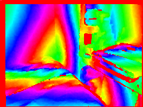

# HUAWEI AR Engine Demo

This if a fork of [hms-AREngine-demo](https://github.com/HMS-Core/hms-AREngine-demo)
I added 2 features :
- Recorder : save camera image and depth every x seconds
- Measure : display the distance (depth) of the object to the camera (center depth pixel)

## Recorder

  

Every seconds save the rgb and depth image, and its pose in the /storage/emulated/0/Android/data/com.huawei.arenginesdk.demo/files/

Features :
- Save depth (240x180 - fancy png, binary depth16)
- Save rgb images (3264x2448 - png + bin)
- Save poses in CSV [download](doc/poses.csv)
- Save rgbd ply [download](HwAREngineDemo/src/test/resources/00000012.ply) (TODO enable it from UI)
- Export to PNG Grayscale 16bits (tum; openCV: CV_16UC1) (TODO enable it from UI)

TODO:
- ply: get depth sensor intrinsics [#1083](https://github.com/google-ar/arcore-android-sdk/issues/1083) + extrinsics between between 2 cameras (try to get [arFrame.acquireSceneMesh()](https://developer.huawei.com/consumer/en/doc/development/HMSCore-References-V5/frame-0000001050121447-V5#EN-US_TOPIC_0000001050126786__section167911410271) ply/obj and compare with mine) [#638](https://github.com/google-ar/arcore-android-sdk/issues/638#issuecomment-438785104)
- merge PLY using poses via UI (only test currently)
- choose photo resolution
- hi-res only some key image as it slow down the app
- try using a thread to save hi-res image
- create obj from ply
- project images on obj
- send images to server merge depth (TSDF - linux - CPU)
  - https://github.com/tum-vision/fastfusion (PNG depth format TODO; reconstrution only)
  - https://pcl.readthedocs.io/projects/tutorials/en/latest/using_kinfu_large_scale.html - Point Cloud Library
  - OpenCV kinfu https://docs.opencv.org/master/d8/d1f/classcv_1_1kinfu_1_1KinFu.html https://github.com/microsoft/Azure-Kinect-Samples/tree/master/opencv-kinfu-samples
  - https://github.com/PrimozLavric/MarchingCubes
  - https://github.com/ros-industrial/yak
  - https://github.com/andyzeng/tsdf-fusion / https://github.com/andyzeng/tsdf-fusion-python (CUDA needed?) (Ubuntu)
  - https://github.com/Nerei/kinfu_remake
  - https://github.com/personalrobotics/OpenChisel
  - https://github.com/MikeSafonov/java-marching-cubes
  - https://github.com/sdmiller/cpu_tsdf
  - https://github.com/pedropro/OMG_Depth_Fusion

Camera Intrinsics (Honor View 20 - AR Engine : [ARCameraIntrinsics](https://developer.huawei.com/consumer/en/doc/HMSCore-References-V5/camera_intrinsics-0000001051140882-V5) + [ARCamera](https://developer.huawei.com/consumer/en/doc/development/HMSCore-Library-V5/camera-0000001050121437-V5) )
- principalPoint : 718.911 543.41327 // (cx, cy)
- imageDimensions : 1440 1080 //(width, heigh)
- distortions : 0.122519 -0.229927 0.144746 -6.96E-4 -4.39E-4
- focalLength : 1072.9441 1075.7474 //(fx, fy ) in px - Why 2 values ?  
- getProjectionMatrix : 1.4902 0 0 0 / 0 3.0466316 0 0 / 0.001512431 0.009666785 -1.002002 -1 / 0 0 -0.2002002 0
Calculated (image is landscape)
- horizontal fov: Math.atan2(1440/2,1075.7473)*180/Math.PI*2=67.6
- vertical   fov: Math.atan2(1080/2,1075.7473)*180/Math.PI*2=53.3
- diagonal : Math.sqrt(Math.pow(1080,2)+Math.pow(1440,2))=1800
- diafov: Math.atan2(1800/2,1075.7473)*180/Math.PI*2=79.8
- cx = width * (1 - proj[2][0]) / 2 = 1440*(1-0.001512431)/2 = 718.911
- cy = height * (1 - proj[2][1]) / 2 = 1080*(1-0.009666785)/2 = 534.780
- fx = width * proj[0][0] / 2 = 1440*1.4902/2=1072.944
- fy = height * proj[1][1] / 2 = 1080*3.0466316/2=1645.18 ?!? seems incorrect!

Camera Intrinsics (Huawei P20 Pro - AR Engine)
- principalPoint: 535.04553 729.8055 //in px
- imageDimensions : 1080 1440 //in px
- distortions : 0.093129 -0.187359 0.138948 1.34E-4 -4.29E-4
- focalLength : 1101.3862 1100.9385 //in px

To get both depth and RGB : 
- AR Engine : [ARFrame](https://developer.huawei.com/consumer/en/doc/HMSCore-References-V5/frame-0000001050121447-V5)
- ARCore + Camera2 API ? : [SharedCamera](https://developers.google.com/ar/reference/java/com/google/ar/core/SharedCamera) - [Doc](https://developers.google.com/ar/develop/java/camera-sharing)
- Camera2 API?

API Camera2 - Honor View 20
(TotalCaptureResult result)
result.get(CaptureResult.LENS_FOCAL_LENGTH) = 4.75
result.get(CaptureResult.LENS_APERTURE) = 1.8
result.get(CaptureResult.LENS_DISTORTION) = [0,0,0,0,0]
result.get(CaptureResult.LENS_FOCUS_DISTANCE) = 1.0713588 //in mm
result.get(CaptureResult.LENS_FOCUS_RANGE) = 0.0 8.0
result.get(CaptureResult.LENS_INTRINSIC_CALIBRATION) = [0,0,0,0,0,0,0,0]

characteristics.get(CameraCharacteristics.SENSOR_INFO_PHYSICAL_SIZE) = 7.28x5.46 //in mm
characteristics.get(CameraCharacteristics.LENS_INFO_AVAILABLE_FOCAL_LENGTHS) = 4.75
characteristics.get(CameraCharacteristics.LENS_INFO_MINIMUM_FOCUS_DISTANCE) = 8
characteristics.get(CameraCharacteristics.LENS_INFO_HYPERFOCAL_DISTANCE) = 0.2
characteristics.get(CameraCharacteristics.DEPTH_DEPTH_IS_EXCLUSIVE) = true
characteristics.get(CameraCharacteristics.LENS_INTRINSIC_CALIBRATION) = [0,0,0,0,0]
characteristics.get(CameraCharacteristics.LENS_POSE_TRANSLATION) = [0,0,0]
characteristics.get(CameraCharacteristics.LENS_POSE_ROTATION) = [1,0,0,0]
characteristics.get(CameraCharacteristics.SENSOR_ORIENTATION) = 90

focalLengh in pixel = CaptureResult.LENS_FOCUS_DISTANCE * 8000 / CameraCharacteristics.SENSOR_INFO_PHYSICAL_SIZE[0]

Huawei P20 Pro #0
result.get(CaptureResult.LENS_FOCAL_LENGTH) = 5.58
result.get(CaptureResult.LENS_APERTURE) = 1.8
result.get(CaptureResult.LENS_DISTORTION) = [0,0,0,0,0]
result.get(CaptureResult.LENS_FOCUS_DISTANCE) = 1.9061583
result.get(CaptureResult.LENS_FOCUS_RANGE) = 0 10
result.get(CaptureResult.LENS_INTRINSIC_CALIBRATION) = [0,X7]
characteristics.get(CameraCharacteristics.SENSOR_INFO_PHYSICAL_SIZE) = 7.3x5.5 //in mm

Huawei P20 Pro #camera zoom
result.get(CaptureResult.LENS_FOCAL_LENGTH) = 7.48
result.get(CaptureResult.LENS_APERTURE) = 2.4
result.get(CaptureResult.LENS_DISTORTION) = [0,0,0,0,0]
result.get(CaptureResult.LENS_FOCUS_DISTANCE) = 9.775171 //change
result.get(CaptureResult.LENS_FOCUS_RANGE) = 0 10
result.get(CaptureResult.LENS_INTRINSIC_CALIBRATION) = [0,X7]
request.get(CaptureRequest.LENS_FOCAL_LENGTH)= 7.48

https://quaternions.online/

## Measure

Measure the distance of the center
